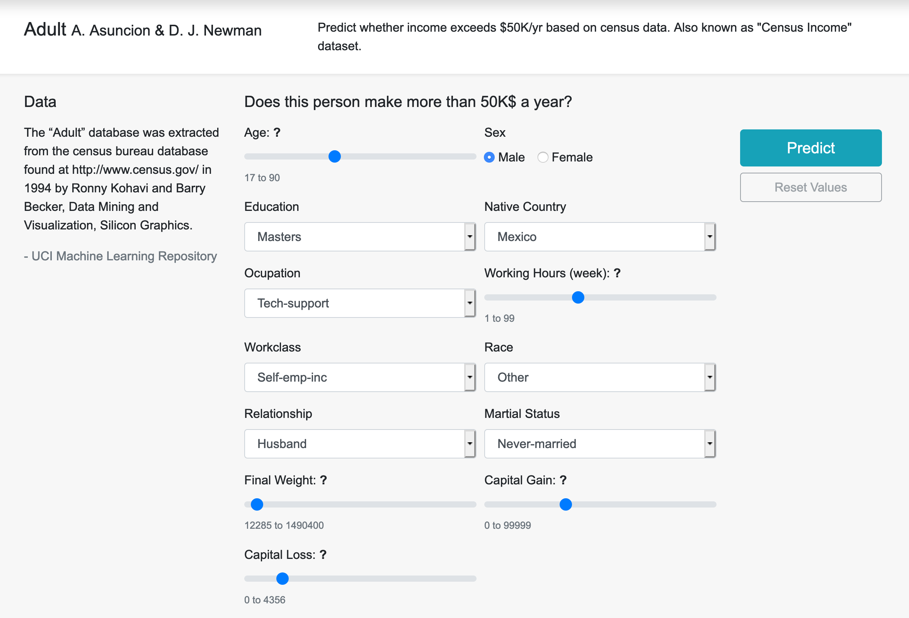

# Pipes - The Data Preparation Pattern

**Pipes** is an end-to-end Machine Learning (ML) system implemented as supporting evidence for the practice-based research called  *The Data Prepararion Pattern*. A masters dissertation final project of the masters course *Advanced Computing - Machine Learning, Data Mining and High Performance Computing (MSc)* at the University of Bristol.

The research endeavour consisted in a theoretical and empirical study of ML systems good implementation practices with focus in **Data Preparation**, built on two traditional software engineering elements; design pattterns and software testing.

## Project Overview
Pipes consists in four end-to-end pipelines, two regressions and two classifications (Forest Fires, Abalone, Wine Quality and Adult). These contain all stages of the ML workflow from data integration, across data cleaning, data validation, feature engineering, model training, evaluation and inference in a user interface.

## System's Architecture
Inspired by [Yokoyama's](https://ieeexplore.ieee.org/document/8712157) layered ML system architecture. Pipes's consist in five components:
- **Data Lake**: Storage of datasets, databases and model files.
- **Data Preparation**: Modules for data cleaning, validation and feature engineering.
- **Trainers**: Environment for modelling exploration, it outputs a trained model.
- **Predictors**: Evaluation of previous model's performance. 
- **Web Application**: Software that benefits from the ML pipeline.


## Findings
The Data Preparation Pattern is the main contribution of this project. It is a generalizable template structure to guide flexible and reliable implementation of all pipeline activities after datasets integration, and before modelling. The pattern abstracts all included sub-activities of the pipeline in three components; data cleaning, data validation and feature engineering.

This pattern is composed by, first, a schema mechanism for feature metadata definiton, a generic-to-specific hierarchy of preparation logic (inheritance), and a pluggable data validation sub-system. This research demonstrated theoretically and empirically that this design for data preparation allows for flexibility and reliability.


#### Folder Structure
- **app/** Flask web application
- **lake/** Contains dataset files, warehouse database and models ()
- **models/** Modules for model training and evaluation
- **pipelines/** Modules for data preparation i.e. all ETL and serving pipelines, schemas, transformations and validators
- **test/** unit-testing suites
- *.ipynb - Exploratory Data Analysis for the four datasets.
- run.py - Web server script


## Set up
### Dependencies 
- Python 3
- pandas
- numpy
- jupyter (notebook)
- scikit-learn
- flask
- flask_sqlalchemy
- sqlalchemy
- pytest

To create the warehouse database, run: 
```
> from app import db
> db.create_all()
```

## Using Pipes
Both, the ETL processes and model training for all pipelines are executable and configurable by a CLI.

### Extract-Transform-Load
For example, to execute the ETL process for the Forest Fires dataset, run:
```
> python -m pipelines.forest_firest_etl
```
 Where `forest_firest_etl` can be replaced with any of the other three datasets for ETL execution. These commands have default parameters (e.g. data source, database target, and others) that can be changed on demand, simply add `--help` to access the documentation.

### Training
To execute training routine, run:
```
> python -m models.train_forest_fires forest_fire_area_regressor.pkl
```
Similar to the previous, `train_forest_fires` is interchangeable with the scripts for the other pipelines. The name of the output model is a mandatory parameter, but other defaults can be modified, see `--help` for details.


### Run Web App
From the root folder, run:
```
> python run.py
```
See an example of the UI interface for people salary's classification (Adult pipeline)




### Run Unit-Tests
```
> python -m pytest
```

## Acknowledgements
Chevening, University of Bristol, Peter Flach, John Biggam, Udacity and Carolina Garza.

Specially thankful to the Software Engineering for Machine Learning (SE4ML) community.

## Licence
MIT License - Copyright (c) 2020 D. Leandro Guardia V.

--- 
Did you find this interesting? Let's chat! Drop me message at `@lean_guardia` in Twitter or `/leandro-guardia` in LinkedIn.