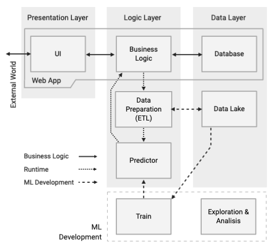
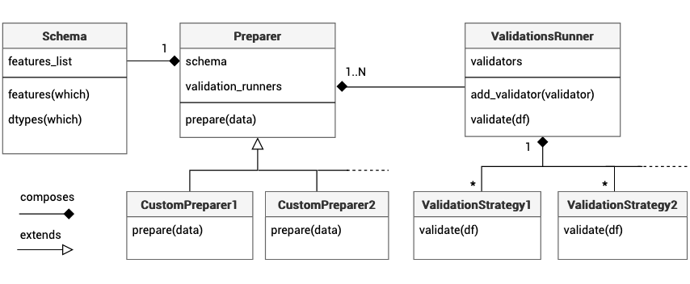

# Pipes - The Data Preparation Pattern

**Pipes** is an end-to-end Machine Learning (ML) system implemented as supporting evidence for the practice-based research called  *The Data Prepararion Pattern*. A masters dissertation final project of the masters course *Advanced Computing - Machine Learning, Data Mining and High Performance Computing (MSc)* at the University of Bristol.

The research endeavour consisted in a theoretical and empirical study of ML systems good implementation practices with focus in **Data Preparation**, built on two traditional software engineering elements; design pattterns and software testing.

## Overview
Pipes consists in four end-to-end pipelines, two regressions and two classifications. These contain all stages of the ML workflow from data integration, across data cleaning, data validation, feature engineering, model training, evaluation and inference. Prior to pipeline 

## Systems Architecture
Inspired by [Yokoyama's](https://ieeexplore.ieee.org/document/8712157) layered ML system architecture.



## Findings
The Data Preparation Pattern is the main contribution of the project. It is a generalizable template structure to guide flexible and reliable implementation of all pipeline activities after datasets integration, and before modelling. The pattern abstracts all included sub-activities of the pipeline in three components; data cleaning, data validation and feature engineering.



#### Folder Structure
- app: Flas web application
- models: 
- pipelines
- test
- *.ipynb

## Dependencies 
- Python 3
- pandas
- numpy
- jupyter (notebook)
- scikit-learn
- flask
- flask_sqlalchemy
- sqlalchemy
- pytest

## Set up
```
> from app import db
> db.create_all()
```

## Using Pipes
Both, the ETL processes and model training for all pipelines is executable and configurable by a CLI. These have default parameters that can be changed on demand, simply add `--help` to print the documentation.

### Extract-Transform-Load
For example, to execute the ETL process for the Forest Fires dataset, run:
```
> python -m pipelines.forest_firest_etl
```

### Training

### Run Web App

## Run Unit-Tests
```
> python -m pytest

```

## Acknowledgements
Chevening, University of Bristol, Peter Flach, John Biggam, Udacity and Carolina Garza.

Specially thankful to the Software Engineering for Machine Learning (SE4ML) community.

## Licence
MIT License - Copyright (c) 2020 D. Leandro Guardia V.
